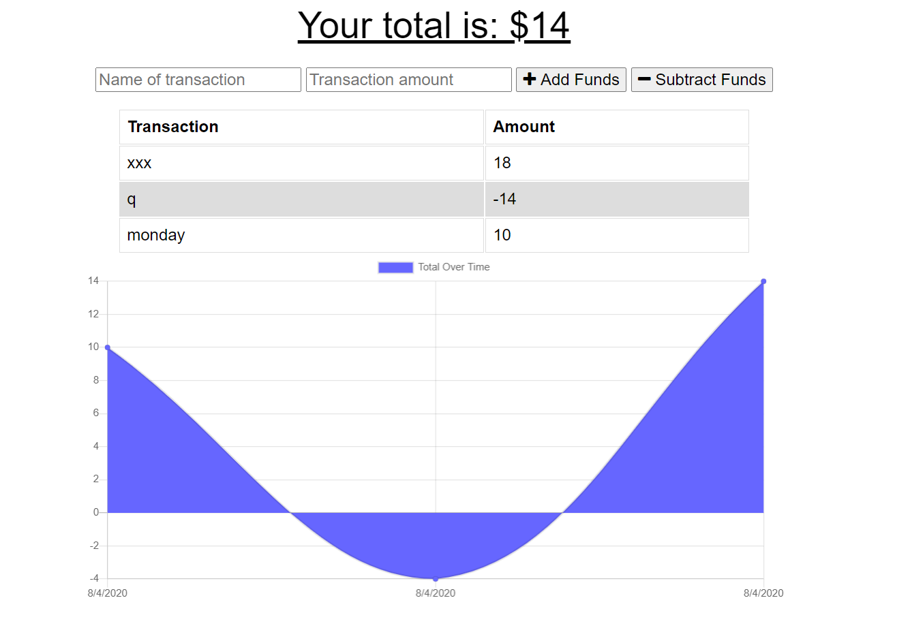

# Title

MongoDB Finance Tracker

This application allows the user to enter financial credits and debits which are then shown on a graph. This application also works while offline.

# Installation

A live deployment can be found here: <a href="https://mongo-budget-tracker109.herokuapp.com/">https://mongo-budget-tracker109.herokuapp.com/</a>

To install locally use the following steps.

<ol>
    <li>Download the files from Github</li>
    <li>Install and setup Node.js</li>
    <li>Install and setup NoSQL booster for MongoDB (or setup cloud hosting)</li>
    <li>Open the downloaded files with VS code.</li>
    <li>Open the terminal while viewing the files (CTRL + `)</li>
    <li>Run the command npm install in your terminal</li>
    <li>Edit line 18 of server.js with your MongoDB details</li>
    <li>Run the terminal command npm start</li>
    <li>The webpage is now available on your device at localhost:3000</li>
</ol>

## Built With
<ul>
<li>Font Awesome - CDN included</li>
<li>Chart.js - CDN included</li>
<li>Node.js and the following packages</li>
<ul>
<li>Mongoose - Installed via Node</li>
<li>Express - Installed via Node</li>
<li>Morgan - Installed via Node</li>
<li>Compression - Installed via Node</li>
</ul>
</ul>

## Code Overview

The page is rendered and styled by the index.html and styles.css files in the public folder. The server and database connection are created with the server.js file and the only routes are back end API routes from the routes/api.js file. The models/transaction.js file defines the model for the database.

